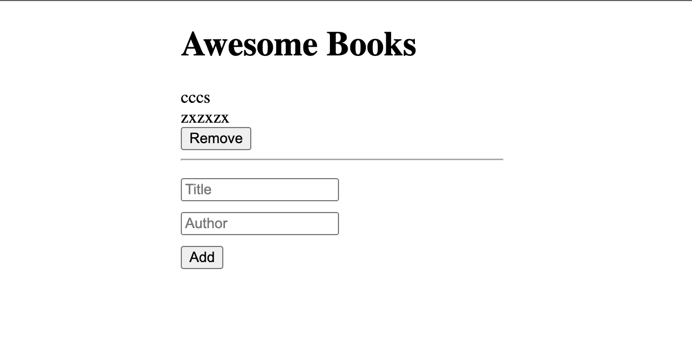

<h1 align="center">Awesome Books</h1>

## About The Project

> We created an app to store, display and remove books from localStorage and UI. This project has been built with the help of modern CSS3 and ES6. Check the live demo to try.

### Built With

* [HTML](https://www.w3schools.com/html/)
* [CSS](https://www.w3schools.com/css/)
* [JS](https://www.javascript.com/)

### Live Demo

[Live Demo Link](https://carloshs1994.github.io/AwesomeBooks/)

## Authors

👤 **Carlos Herver Solano**

- GitHub: [@carloshs1994](https://github.com/carloshs1994)

👤 **Ibrohim Rasulov**

- GitHub: [@IbrohimRasulov](https://github.com/IbrohimRasulov)
- Twitter: [@IbrohimRasu1ov](https://twitter.com/IbrohimRasu1ov)
- LinkedIn: [LinkedIn](https://www.linkedin.com/in/ibrohim-rasulov-a88352209/)

## Getting Started

* You will not need additional instructions on installing Prerequisites.
* In case you have node_modules on your folder Add them to .gitignore file before you a push.

### Prerequisites

* No prerequisites needed for this project.

## Contributing

Contributions are what make the open source community such an amazing place to be learn, inspire, and create. Any contributions you make are **greatly appreciated**.

1. Fork the Project
2. Create your Feature Branch (`git checkout -b feature/NewFeature`)
3. Commit your Changes (`git commit -m 'Add some NewFeature'`)
